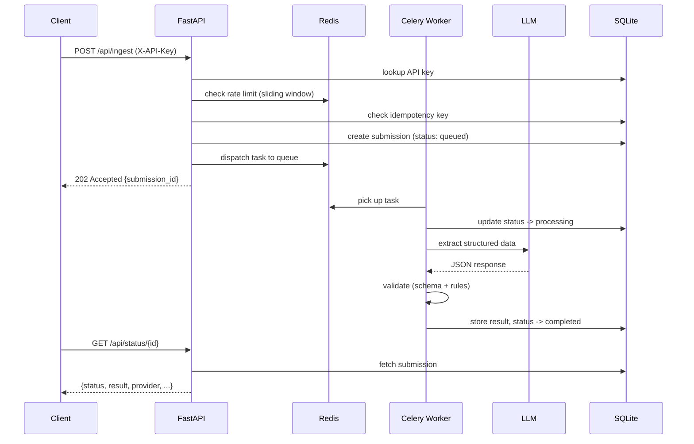
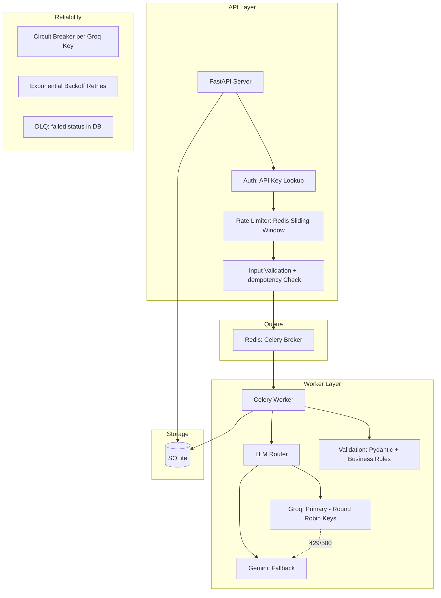
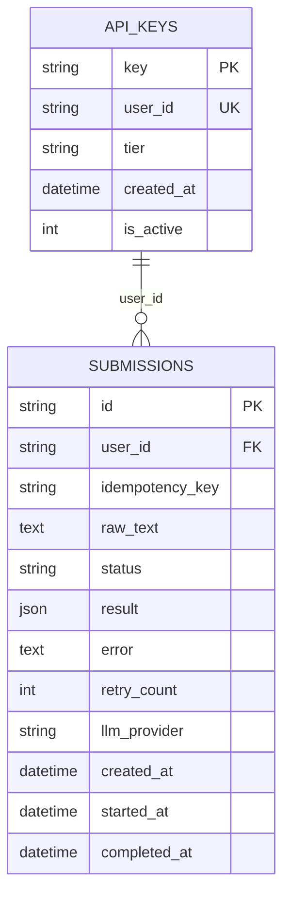
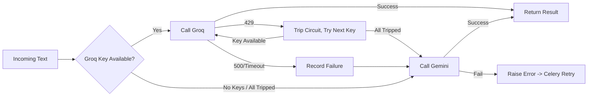

# AI Content Processing Pipeline

Async multi-tenant text ingestion pipeline. Takes raw text (job/internship postings), queues it for processing, extracts structured data via LLMs, validates output through layered checks, and stores results with full status tracking.

## Why this domain

I built a similar ingestion pipeline in production for a job aggregation platform. That system was admin-only, single-tenant, with OCR support for screenshots. For this assignment I stripped the OCR layer (adds complexity without demonstrating system design), kept the extraction core, and redesigned it for multi-user concurrency with proper queueing, rate limiting, and fault tolerance.

## Architecture

### Request Flow



### System Components



### Data Model



### LLM Fallback Strategy



## Setup

### Prerequisites
- Python 3.11+
- Docker (for Redis)
- At least one LLM API key (Groq or Gemini)

### Run

```bash
# create venv and install
python -m venv venv
.\venv\Scripts\activate        # windows
# source venv/bin/activate     # linux/mac
pip install -r requirements.txt

# copy env and add your LLM keys
cp .env.example .env

# start redis
docker compose up -d

# seed test API keys
python test.py

# start the API (terminal 1)
uvicorn backend.main:app --reload --port 8000

# start the worker (terminal 2)
celery -A backend.celery_app worker --loglevel=info --pool=solo
```

### Testing the LLM Independently

If you only want to verify the LLM extraction logic and fallback router without spinning up Redis, Celery, or the FastAPI web server, you can run the standalone test script:

```bash
python test_llm.py
```

## API Endpoints

### POST /api/ingest
Submit text for structured extraction. Returns immediately with a submission ID.

```bash
curl -X POST http://localhost:8000/api/ingest \
  -H "Content-Type: application/json" \
  -H "X-API-Key: test-key-user-1" \
  -d '{
    "text": "Hiring at Google for SDE Intern, batch 2025, stipend 80000/month, Bangalore. Apply at careers.google.com",
    "idempotency_key": "unique-123"
  }'
```

Response: `202 Accepted`
```json
{"submission_id": "uuid", "status": "queued", "message": "submission queued for processing"}
```

### GET /api/status/{submission_id}
Poll for processing result.

```bash
curl http://localhost:8000/api/status/<submission_id> \
  -H "X-API-Key: test-key-user-1"
```

### GET /api/submissions
List all your submissions (most recent first, max 50).

```bash
curl http://localhost:8000/api/submissions \
  -H "X-API-Key: test-key-user-1"
```

### GET /health
Health check, no auth needed.

## Project Structure

```
backend/
  config.py        - env-based configuration
  db.py            - SQLAlchemy engine and session
  models.py        - Submission + ApiKey tables
  schemas.py       - Pydantic request/response/extraction models
  main.py          - FastAPI routes, auth, rate limiting
  celery_app.py    - Celery broker setup
  tasks.py         - background worker task
  llm.py           - LLM router with circuit breaker + fallback
  rate_limiter.py  - Redis sliding window rate limiter
  validation.py    - schema + rule-based output validation
test.py            - seeds test API keys into the DB
docker-compose.yml - Redis container
```
